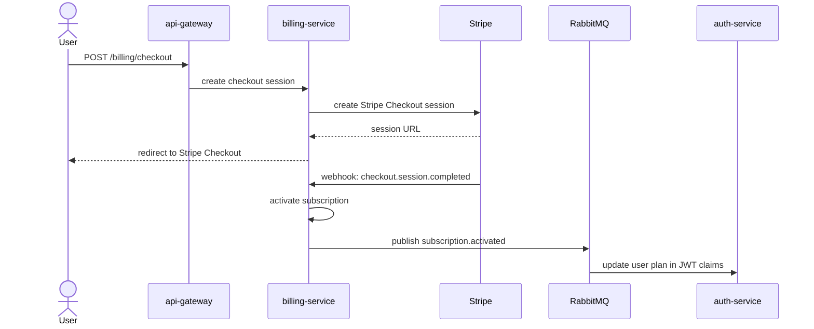

# Billing — Stripe + Subscription Tiers

Stripe handles payments. A dedicated `billing-service` handles Stripe webhooks and enforces plan limits.
Stripe webhooks are just another event source — fits naturally into the event-driven architecture.

---

## Subscription Tiers

| Feature                  | Free | Pro       | Family    |
| ------------------------ | ---- | --------- | --------- |
| Transactions per month   | 50   | Unlimited | Unlimited |
| Household members        | 2    | 5         | 10        |
| Budget alerts            | ✅   | ✅        | ✅        |
| Reports (monthly/yearly) | ❌   | ✅        | ✅        |
| CSV export               | ❌   | ✅        | ✅        |
| AI categorization        | ❌   | ✅ 10/day | ✅        |
| AI insights + NL search  | ❌   | ❌        | ✅        |
| Activity log             | ❌   | ✅        | ✅        |
| Priority support         | ❌   | ❌        | ✅        |

### Pricing per region

| Plan   | 🇳🇴 Norway (NOK) | 🇧🇷 Brazil (BRL) | 🌍 International (USD) |
| ------ | --------------- | --------------- | ---------------------- |
| Pro    | kr 99 / mnd     | R$ 29,90 / mês  | $9.99 / mo             |
| Family | kr 149 / mnd    | R$ 44,90 / mês  | $14.99 / mo            |

This is handled entirely within Stripe — one product, multiple prices in different currencies.
No conversion, no exchange rates. Each region has its own fixed local price set in the Stripe dashboard.

---

## Architecture

Stripe sends webhook events → `billing-service` processes them → publishes internal events → other services react.



---

## billing-service

**Database tables:** `subscriptions`, `billing_events`

### REST Endpoints

| Method | Path                    | Description                                                                       |
| ------ | ----------------------- | --------------------------------------------------------------------------------- |
| GET    | `/billing/plans`        | List available plans + prices                                                     |
| POST   | `/billing/checkout`     | Create Stripe Checkout session → returns redirect URL                             |
| POST   | `/billing/portal`       | Create Stripe Customer Portal session (manage/cancel)                             |
| GET    | `/billing/subscription` | Get current subscription status + usage for household                             |
| GET    | `/billing/limits`       | Internal — plan limits for a household (called by other services for enforcement) |
| POST   | `/billing/webhook`      | Stripe webhook receiver (public, Stripe-signed)                                   |

### Stripe Webhooks Handled

| Stripe Event                    | Action                                                                              |
| ------------------------------- | ----------------------------------------------------------------------------------- |
| `checkout.session.completed`    | Set status `active`, store `stripeCustomerId`                                       |
| `customer.subscription.updated` | Sync status from Stripe (handles `past_due` promotions too)                         |
| `invoice.payment_failed`        | Set status `past_due`, publish `subscription.payment.failed` — **do not downgrade** |
| `customer.subscription.deleted` | Set status `cancelled`, publish `subscription.cancelled` — downgrade to Free        |

> `past_due` is a grace period — Stripe retries for ~2 weeks. Users keep full access until `customer.subscription.deleted` fires. See edge-cases.md for the full status lifecycle.

### Events Published

| Event                         | Payload                            | When                       |
| ----------------------------- | ---------------------------------- | -------------------------- |
| `subscription.activated`      | `{ householdId, plan, expiresAt }` | After successful payment   |
| `subscription.cancelled`      | `{ householdId, plan }`            | After cancellation/failure |
| `subscription.payment.failed` | `{ householdId, userId }`          | After failed invoice       |

### Events Consumed

| Event               | Action                                                                                         |
| ------------------- | ---------------------------------------------------------------------------------------------- |
| `household.created` | Create 14-day Pro trial for the household — one trial per user (checked via `createdByUserId`) |
| `household.deleted` | Cancel active Stripe subscription via API + mark local `subscriptions` record as `cancelled`   |

---

## Plan Enforcement

Plan limits are enforced in each service, not centrally:

- `transaction-service` — checks household's plan before creating if monthly count ≥ 50 (Free)
- `household-service` — checks member count limit on invite
- `report-service` — returns 403 if household is on Free plan
- `auth-service` — includes `plan` in JWT claims so frontend can show/hide features instantly without an API call

### JWT Claims (updated)

```json
{
  "sub": "uuid",
  "email": "user@example.com",
  "plan": "free | pro | family"
}
```

> `plan` is client-side UI only. Server-side enforcement queries billing-service directly — never trusts the JWT claim. After upgrade, frontend calls `POST /auth/refresh` to get an updated token immediately.

---

## Frontend

### New settings page: Billing

Added to `mfe-settings`:

- Current plan + usage (transactions this month, member count)
- Upgrade CTA for Free users
- "Manage subscription" button → Stripe Customer Portal (handles upgrades, downgrades, cancellation)
- Invoice history (via Stripe Portal — no custom UI needed)

### Plan gates in the UI

The shell reads `plan` from JWT claims and:

- Shows upgrade prompts when Free users hit limits
- Hides Pro/Family features with a lock icon + upgrade CTA
- No extra API call needed — plan is in the token

---

## Stripe Setup (Coolify env vars)

```env
# billing-service
STRIPE_SECRET_KEY=sk_live_...
STRIPE_WEBHOOK_SECRET=whsec_...

# One price ID per plan per currency (created in Stripe dashboard)
STRIPE_PRICE_PRO_NOK=price_...
STRIPE_PRICE_PRO_BRL=price_...
STRIPE_PRICE_PRO_USD=price_...

STRIPE_PRICE_FAMILY_NOK=price_...
STRIPE_PRICE_FAMILY_BRL=price_...
STRIPE_PRICE_FAMILY_USD=price_...
```

The `billing-service` selects the right price ID based on the household's `currency` field:

```typescript
function getPriceId(plan: 'pro' | 'family', currency: string): string {
  const prices = {
    pro: {
      NOK: process.env.STRIPE_PRICE_PRO_NOK,
      BRL: process.env.STRIPE_PRICE_PRO_BRL,
      USD: process.env.STRIPE_PRICE_PRO_USD,
    },
    family: {
      NOK: process.env.STRIPE_PRICE_FAMILY_NOK,
      BRL: process.env.STRIPE_PRICE_FAMILY_BRL,
      USD: process.env.STRIPE_PRICE_FAMILY_USD,
    },
  };
  return prices[plan][currency] ?? prices[plan]['USD']; // fallback to USD
}
```

### Webhook endpoint

Register `https://api.familieoya.furevikstrand.cloud/billing/webhook` in the Stripe dashboard.
The billing-service verifies the `Stripe-Signature` header on every request.

**Implementation requirements:**

- NestJS must be started with `rawBody: true` — Stripe's `constructEvent()` requires the raw Buffer, not the parsed JSON body. Without this, signature verification always fails silently.
  ```typescript
  // billing-service/src/main.ts
  const app = await NestFactory.create(AppModule, { rawBody: true });
  ```
- Idempotency is handled via `billing_events` table. Each Stripe `event.id` is stored with a unique constraint. The insert + processing happen in a single DB transaction — duplicate delivery returns 200 immediately (not 4xx, which would cause Stripe to keep retrying).

See edge-cases.md for the full handler implementation.

---

## Free Trial

New households get **14 days of Pro** automatically.
`household-service` publishes `household.created` → `billing-service` creates a 14-day Pro trial for that household.
No credit card required to start.

- One trial per user (not per household) — prevents abuse via multiple household creation
- Trial expiry is managed by a daily cron in billing-service (no Stripe subscription until the user pays)
- On expiry: household downgrades to Free + `subscription.cancelled` published
- See edge-cases.md for the full implementation.
